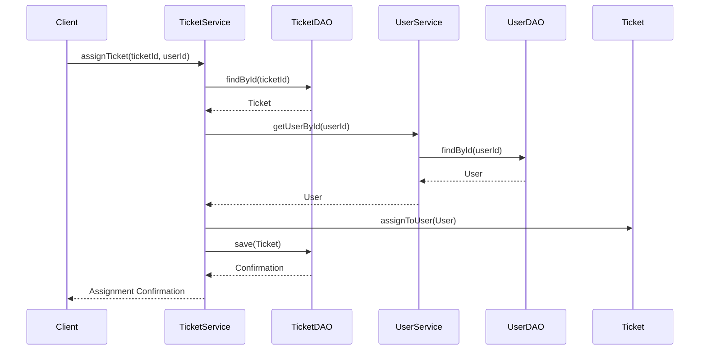

```mermaid
sequenceDiagram
    participant Client
    participant TicketService
    participant TicketDAO
    participant UserService
    participant UserDAO

    Client->>TicketService: assignTicket(ticketId, userId)
    TicketService->>TicketDAO: findById(ticketId)
    TicketDAO-->>TicketService: Ticket
    TicketService->>UserService: getUserById(userId)
    UserService->>UserDAO: findById(userId)
    UserDAO-->>UserService: User
    UserService-->>TicketService: User
    TicketService->>Ticket: assignToUser(User)
    TicketService->>TicketDAO: save(Ticket)
    TicketDAO-->>TicketService: Confirmation
    TicketService-->>Client: Assignment Confirmation

```
